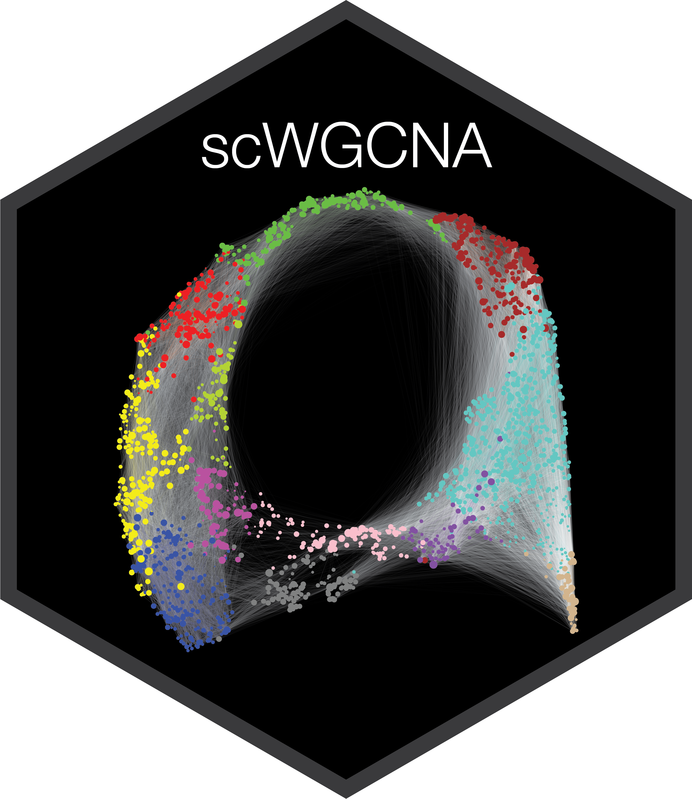

# high dimensional WGCNA 


[](https://github.com/smorabit/hdWGCNA/tree/dev)
[](https://github.com/smorabit/hdWGCNA/issues)
[](https://www.cell.com/cell-reports-methods/fulltext/S2667-2375(23)00127-3)
[](https://github.com/smorabit/hdWGCNA)
[](https://github.com/smorabit/hdWGCNA/)


hdWGCNA is an R package for performing weighted gene co-expression network analysis [(WGCNA)](https://doi.org/10.1186/1471-2105-9-559) in high dimensional transcriptomics data such as single-cell RNA-seq or spatial transcriptomics. hdWGCNA is highly modular and can construct context-specific co-expression networks across cellular and spatial hierarchies. hdWGNCA identifies modules of highly co-expressed genes and provides context for these modules via statistical testing and biological knowledge sources. hdWGCNA uses datasets formatted as [Seurat](https://satijalab.org/seurat/index.html) objects. Check out the [hdWGCNA in single-cell data tutorial](https://smorabit.github.io/hdWGCNA/articles/basic_tutorial.html) or the [hdWGCNA in spatial transcriptomics data tutorial](https://smorabit.github.io/hdWGCNA/articles/ST_basics.html) to get started.

**New functionality:** hdWGCNA is now able to perform [Transcription Factor Regulatory Network Analysis](https://smorabit.github.io/hdWGCNA/articles/tf_network.html). This functionality was introduced in our publication [Childs & Morabito et al., Cell Reports (2024)](https://www.sciencedirect.com/science/article/pii/S2211124724002845).

If you use hdWGCNA in your research, please cite the manuscript describing hdWGCNA in addition to the [original WGCNA publication](https://doi.org/10.1186/1471-2105-9-559):

* [hdWGCNA identifies co-expression networks in high-dimensional transcriptomics data.
 Morabito et al., Cell Reports Methods (2023)](https://www.cell.com/cell-reports-methods/fulltext/S2667-2375(23)00127-3)

## Installation

We recommend creating an R [conda environment](https://docs.conda.io/en/latest/) environment for hdWGCNA.

```bash
# create new conda environment for R
conda create -n hdWGCNA -c conda-forge r-base r-essentials

# activate conda environment
conda activate hdWGCNA
```

Next open R and install the required dependencies:

* [Bioconductor](https://www.bioconductor.org/), an R-based software ecosystem for bioinformatics and biostatistics.
* [devtools](https://devtools.r-lib.org/), a package for package development in R.
* [Seurat](https://satijalab.org/seurat/index.html), a general-purpose toolkit for single-cell data science.

```r
# install BiocManager
install.packages("BiocManager")

# install Bioconductor core packages
BiocManager::install()

# install devtools
BiocManager::install("devtools")

# install additional packages
BiocManager::install(c("WGCNA", "UCell", "GenomicRanges", "GeneOverlap"))

# install latest version of Seurat from CRAN
install.packages("Seurat")

# alternatively, install Seurat v4
install.packages("Seurat", repos = c("https://satijalab.r-universe.dev', 'https://cloud.r-project.org"))

```

Now you can install the hdWGCNA package using `devtools`.

```r
devtools::install_github('smorabit/hdWGCNA', ref='dev')
```

<details> <summary> Troubleshooting the installation </summary>

If you have trouble installing some of the dependencies, we advise trying to install them using alternative sources. For example, if you try to install the package using Bioconductor or CRAN, try instead with conda. Let's say you have trouble installing `devtools`, try instead to use conda:

```
conda install conda-forge::r-devtools
```

For specific problems, please write a [GitHub issue](https://github.com/smorabit/hdWGCNA/issues) and we will try to help you.

</details>

## Suggested Reading

To learn more about the method and to see several examples of analyzing different datasets, please check out the paper describing hdWGCNA (Morabito et al 2023). We also suggest our follow-up paper introducing transcription factor regulatory network analysis with hdWGCNA (Childs & Morabito et al 2024). 

* hdWGCNA method description: [hdWGCNA identifies co-expression networks in high-dimensional transcriptomics data](https://www.cell.com/cell-reports-methods/fulltext/S2667-2375(23)00127-3) 
* Transcription factor networks: [Relapse to cocaine seeking is regulated by medial habenula NR4A2/NURR1 in mice](https://www.sciencedirect.com/science/article/pii/S2211124724002845)

For additional reading, we suggest the original WGCNA publication and papers describing relevant algorithms for co-expression network analysis.

* [WGCNA: an R package for weighted correlation network analysis](https://doi.org/10.1186/1471-2105-9-559)
* [Defining clusters from a hierarchical cluster tree: the Dynamic Tree Cut package for R](https://doi.org/10.1093/bioinformatics/btm563)
* [Is My Network Module Preserved and Reproducible?](https://doi.org/10.1371/journal.pcbi.1001057)

**Note about package development:** hdWGCNA is under active development, so you may run into errors and small typos. We welcome users to write [GitHub issues](https://docs.github.com/en/issues/tracking-your-work-with-issues/creating-an-issue) to report bugs, ask for help, and to request potential enhancements. 
